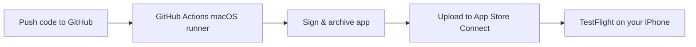

# TestFlight via GitHub Actions

This guide walks through building **BasicApp** in the cloud and installing it on your iPhone with **TestFlight** — no Mac required day to day.

You will need a **paid Apple Developer account** ($99/year) and about **30–60 minutes of one-time setup**.

## Overview



After setup, every workflow run can deliver a new build to your phone through the TestFlight app.

---

## Step 1: Apple Developer & App Store Connect

1. Enroll in the [Apple Developer Program](https://developer.apple.com/programs/).
2. Open [App Store Connect](https://appstoreconnect.apple.com/) → **Apps** → **+** → **New App**.
3. Set the bundle ID to **`com.brunabaudel.BasicApp`** (create the App ID in [Certificates, Identifiers & Profiles](https://developer.apple.com/account/resources/identifiers/list) if it does not exist yet).
4. Note your **Team ID** (10 characters) from [Membership details](https://developer.apple.com/account#MembershipDetailsCard).

---

## Step 2: App Store Connect API key

1. App Store Connect → **Users and Access** → **Integrations** → **App Store Connect API**.
2. Create a key with **App Manager** (or Admin) access.
3. Download the `.p8` file immediately — Apple only lets you download it once.
4. Save:
   - **Issuer ID**
   - **Key ID**
   - **Private key** (`.p8` file contents)

---

## Step 3: Signing certificate & provisioning profile

GitHub Actions needs an **Apple Distribution** certificate and an **App Store** provisioning profile. You only create these once.

### If you have access to a Mac (even briefly)

1. Open Xcode → **Settings** → **Accounts** → select your Apple ID → **Manage Certificates** → **+** → **Apple Distribution**.
2. In [Developer Portal](https://developer.apple.com/account/resources/profiles/list), create an **App Store** profile for `com.brunabaudel.BasicApp` and download it.
3. Export the distribution certificate from Keychain Access as a `.p12` file (set a password).
4. Run the helper script:

```bash
cd BasicApp
chmod +x scripts/export-signing-secrets.sh
./scripts/export-signing-secrets.sh ~/Desktop/distribution.p12 ~/Downloads/BasicApp_App_Store.mobileprovision
```

Copy the printed base64 values into GitHub secrets.

### If you do not have a Mac

Borrow one, use a cloud Mac service (MacinCloud, MacStadium, etc.), or ask a friend — you only need it for this step. After secrets are in GitHub, you will not need a Mac again.

---

## Step 4: Add GitHub secrets & variables

In your repo: **Settings → Secrets and variables → Actions**.

### Secrets

| Name | Value |
|------|-------|
| `BUILD_CERTIFICATE_BASE64` | Base64 of your `.p12` distribution certificate |
| `P12_PASSWORD` | Password for the `.p12` file |
| `BUILD_PROVISION_PROFILE_BASE64` | Base64 of the App Store `.mobileprovision` file |
| `KEYCHAIN_PASSWORD` | Any random string (e.g. `openssl rand -base64 32`) |
| `DEVELOPMENT_TEAM` | Your 10-character Apple Team ID |
| `APPSTORE_API_PRIVATE_KEY` | Full contents of the `.p8` API key file |

### Variables

| Name | Value |
|------|-------|
| `APPSTORE_ISSUER_ID` | Issuer ID from App Store Connect API |
| `APPSTORE_API_KEY_ID` | Key ID from App Store Connect API |

## Step 5: Run the workflow

1. Merge the branch with the workflow, or push to `app/ebb` / `main`.
2. Go to **Actions → TestFlight → Run workflow** (manual trigger works too).
3. Wait for the build to finish (typically 5–15 minutes).
4. Open the **TestFlight** app on your iPhone.
5. Accept the invite if prompted, then install **BasicApp**.

> **First upload:** App Store Connect may take 10–30 minutes to process the build before it appears in TestFlight.

---

## Troubleshooting

| Problem | Fix |
|---------|-----|
| `No signing certificate` | Re-export `.p12` and update `BUILD_CERTIFICATE_BASE64` |
| `No profiles for ...` | Ensure profile is **App Store** type and matches `com.brunabaudel.BasicApp` |
| `Authentication failed` on upload | Check API key role, Issuer ID, Key ID, and `.p8` contents |
| Build number conflict | Workflow sets build number from `github.run_number`; re-run the workflow |
| App not in TestFlight | Wait for Apple processing; check App Store Connect → TestFlight tab |

---

## What runs in CI

- **Pull requests:** simulator-only build (no signing secrets required).
- **Push / manual run:** archive → sign → export IPA → upload to TestFlight.

Workflow file: [`.github/workflows/testflight.yml`](../.github/workflows/testflight.yml)
